# 주차삐카

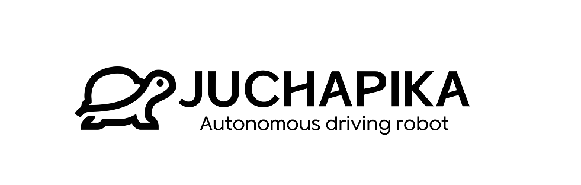

<br/>
<br/>

## Juchapika

> #### **"자율주행을 활용한 무인 주정차 단속 로봇"<br/>**
>
> <b style="color:#555555">프로젝트 기간 : 2023.04.10 ~ 2023.05.19</b>

<br/>

_프로젝트 Juchapika는 자율주행 및 실시간 카메라 송수신을 활용한 무인 주정차 단속로봇입니다. 오늘날, 많은 불법 주정차량으로 인해 크고 작은 인명피해들이 발생하고 있습니다. 이 뿐만 아니라 많은 불법 주정차량을 단속하기에 인력 부족으로 모두 단속하기가 어려우며, 단속 과정에서 오가는 감정싸움으로 인해 단속 공무원들을 대표적인 감정 노동자라고 불린다고 합니다. 이러한 복합적인 문제를 해결하고자 무인 주정차 단속 로봇을 기획하게 되었습니다._

<br/>
<br/>


<br/>
<br/>

## **Stacks**

#### **Environment**

<div style='display:flex;margin-bottom:20px'>


</div>

#### **CI/CD**

<div style='display:flex;margin-bottom:20px'>


</div>

#### **Development**

<div style='display:flex;margin-bottom:20px'>


</div>

#### **Comunication**

<div style='display:flex;margin-bottom:20px'>


</div>

<br/>
<br/>
<br/>
<br/>

## 주요 기능 📦

<br/>

# 1. 촬영 영상 실시간 스트리밍 및 번호판 인식 


> ### AWS Kinesis Video Stream를 사용하여 실시간 영상 탐지 및 스트리밍


<br/>
<br/>
<br/>
<br/>
<br/>

> ### YOLO5 객체 탐지 알고리즘을 활용한 실시간 번호판 탐지
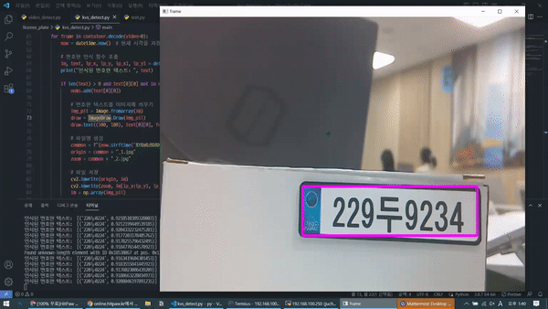

<br/>
<br/>
<br/>
<br/>
<br/>


# 2. 단속 결과 처리


> ### 단속 차량 수정
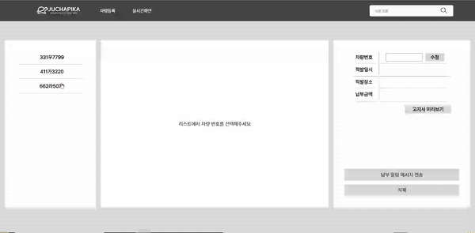

<br/>
<br/>
<br/>
<br/>
<br/>

> ### 단속 차량 등록
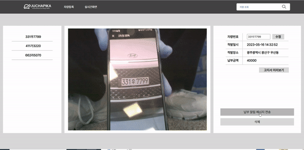

<br/>
<br/>
<br/>
<br/>
<br/>

> ### 고지서 미리보기
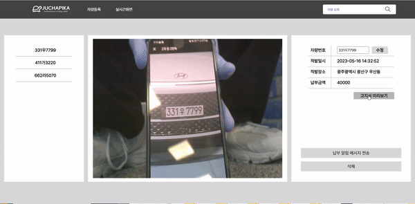

<br/>
<br/>
<br/>
<br/>
<br/>

> ### 납부 알람 전송


<br/>
<br/>
<br/>
<br/>
<br/>


> ### 단속 내역 조회
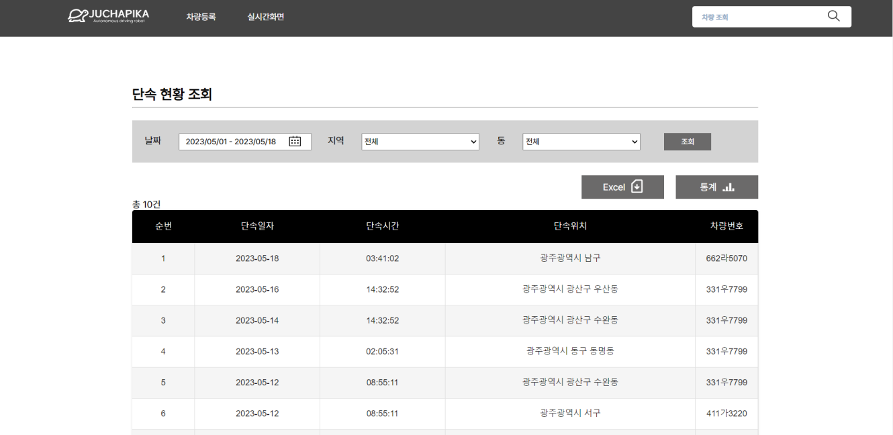

---

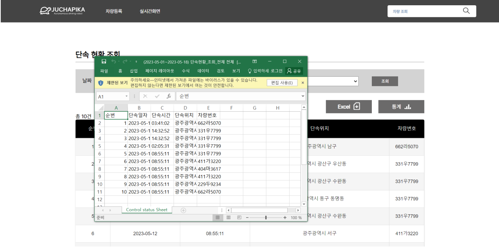

---

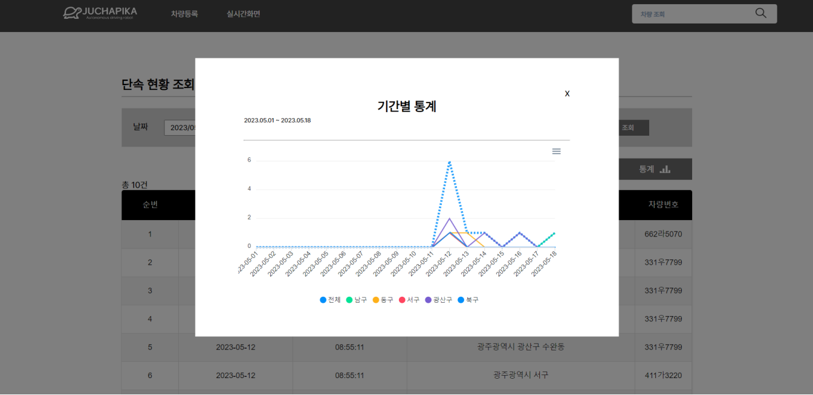

---

<br/>
<br/>
<br/>
<br/>
<br/>


> ### 단속차량 검색
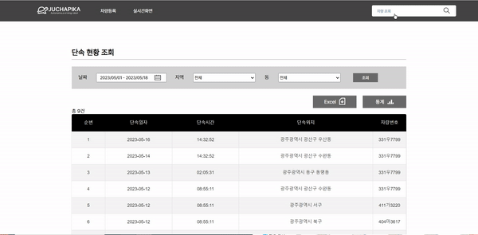


<br/>
<br/>
<br/>
<br/>
<br/>


> ### 납세자 문자
**(고지서 링크 첨부: 납세자의 상세고지서내용 및 납부이력 확인용/**개인정보 유출 방지 암호화 구현 )
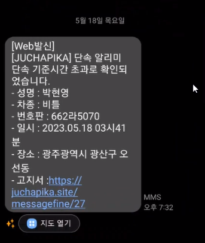

<br/>
<br/>
<br/>
<br/>
<br/>


> ### 모바일 고지서
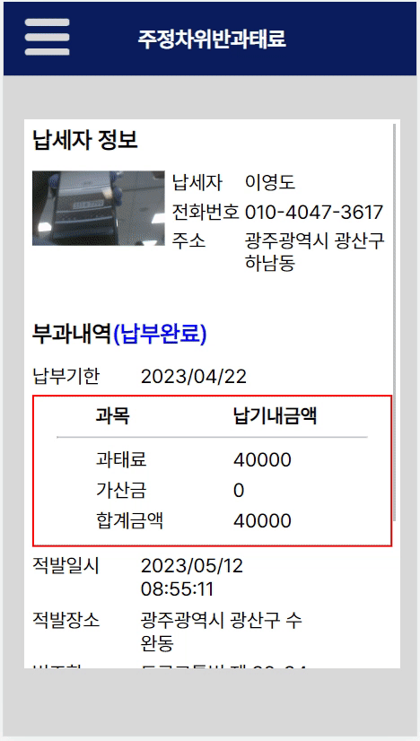


<br/>
<br/>
<br/>
<br/>
<br/>


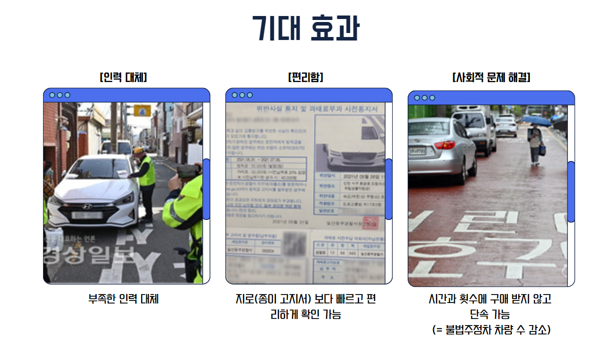


<br/>
<br/>
<br/>
<br/>


## 프로젝트 파일 구조 ✔
### Back-end
```
└── Supervision
    ├── SupervisionApplication.java
    ├── config
    ├── controller
    ├── dto
    │   ├── jwt
    │   ├── request
    │   └── response
    ├── entity
    │   ├── battery
    │   ├── car
    │   ├── record
    │   └── user
    ├── repository
    │   ├── car
    │   ├── record
    │   └── user
    ├── security
    └── service
        ├── car
        ├── fee
        ├── record
        └── user
```

### Front-end
```
├── Dockerfile
├── README.md
├── deploy_conf
│   └── nginx.conf
├── firebase.json
├── firestore.indexes.json
├── public
├── src
│   ├── components
│   │   ├── Nav
│   │   └── Table
│   ├── hooks
│   ├── pages
│   │   ├── EnrollmentCar
│   │   ├── Fire.jsx
│   │   ├── FirstPage
│   │   ├── ForPerson
│   │   ├── LiveStream
│   │   ├── Main.jsx
│   │   ├── Main.module.css
│   │   └── VideoStorage
│   ├── reportWebVitals.js
│   ├── rollup.config.js
│   ├── setupTests.js
│   ├── tsconfig.json
│   ├── tslint.json
│   ├── useViewer.jsx
│   └── withErrorLog.ts
├── webpack.config.js
├── webpack.debug.config.js
├── webpack.dev.config.js
└── webpack.dist.config.js
```


<br/>
<br/>
<br/>
<br/>

## 아키텍처 설계도

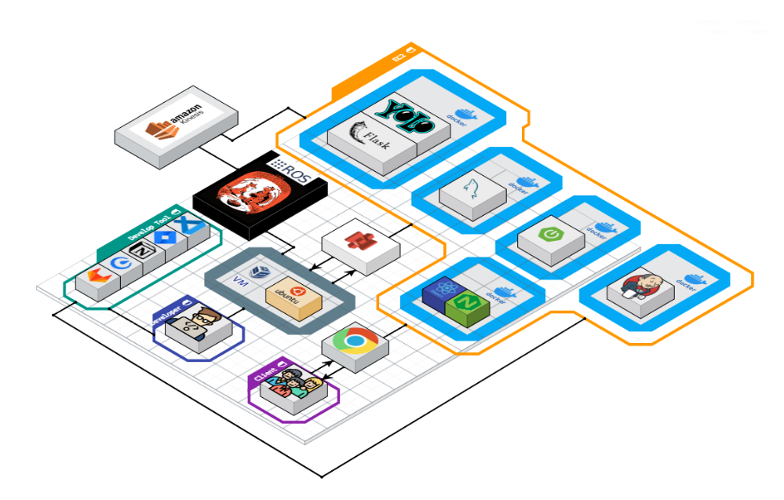

<br/>
<br/>
<br/>
<br/>


## 사이트맵


<br/>
<br/>
<br/>
<br/>

## ERD

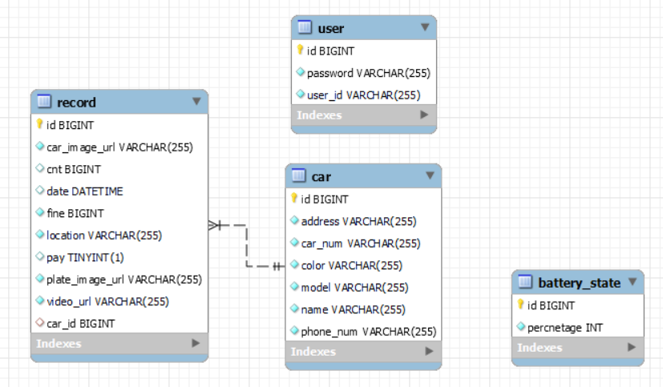

<br/>
<br/>
<br/>
<br/>

## API

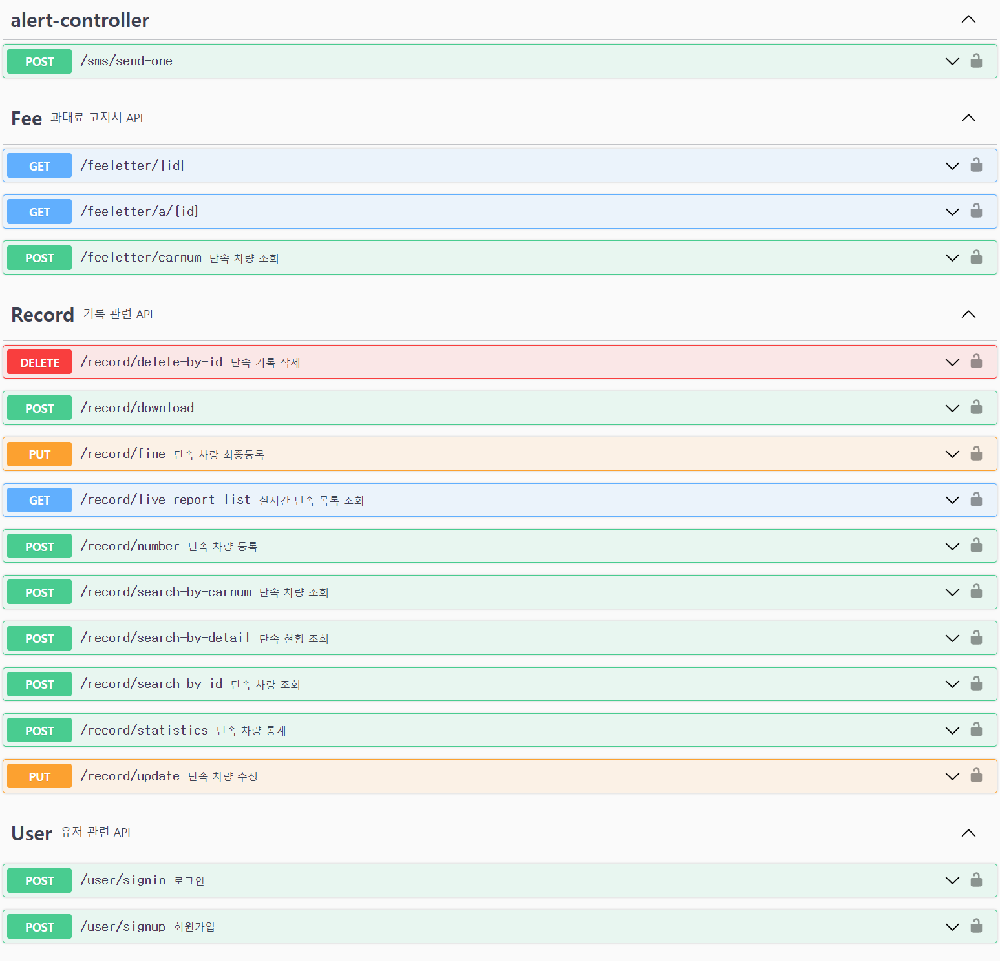

<br/>
<br/>
<br/>
<br/>

## 시스템 기술서

## 1. 프로젝트 핵심 기술
- Spring Web
- Spring Secutiry + JWT
- Spring Data JPA
- Let’s Encrypt
- Lombok
- MySQL MariaDB
- AWS (EC2)
- Jenkins

<br/>

## 2. 핵심 기술 소개

### 2-1. Spring Data JPA (+ QureyDsl)

<br/>

ORM(Object Relational Mapping) 기술을 기반하는 JPA를 활용하여 객체와 테이블을 매핑하였습니다. 추가적으로 동적 쿼리문를 통한 유연한 쿼리문을 생성하기 위해서 QueryDsl을 활용하였습니다. 또한, Pagable 을 이용하여 무한 스크롤을 구현하였습니다.

<br/>


<br/>

### 2-2. Spring Security (+ JWT)

<br/>

사용자가 로그인을 하게 되면, 서버는 JWT 토큰을 생성하고 클라이언트에게 반환합니다. 클라이언트는 이 JWT 토큰을 저장하고, 서버에 요청할 때마다 헤더에 포함하여 서버에 전송합니다. 서버는 JWT 토큰을 검증하여 사용자를 인증하고, 필요한 권한을 확인하여 해당 작업을 수행합니다. 

이 JWT 토큰은 클라이언트가 자원 서버에 접근할 때 Access Token으로 사용합니다. 자원 서버는 Access Token을 검증하여 클라이언트의 권한을 확인하고, 요청을 처리할 수 있습니다.

<br/>


<br/>

### 2-3. YOLOv5(객체 탐지 알고리즘) 를 활용한 번호판 인식

<br/>

실시간으로 촬영되는 영상을 프레임별로 나누어 YOLOv5를 활용하여 번호판을 인식했습니다. (학습 모델: https://github.com/gyupro/EasyKoreanLpDetector/blob/main/lp_det.pt) 한국어를 포함한 글자를 추출하기 위해 EasyOCR(문자 영역 인식(Detection) + 문자 인식(Recognition)기능을 모두 하는 프레임워크)을 사용했고, 인식률이 80% 이상인 번호판의 번호를 추출하였습니다.

<br/>

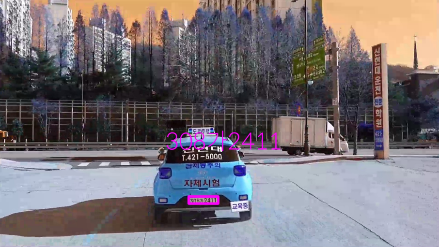

<br/>

### 2-4. AWS Kinesis 실시간 비디오 스트리밍

<br/>

TurtleBot에서 촬영하는 영상을 분석 및 스트리밍을 위해서, 실시간 데이터 스트리밍을 처리하는 데 중점을 둔 완전 관리형 서비스 AWS Kinesis를 사용하였습니다. 
<br>
(참고 문헌: https://www.smarthome-diy.info/blog/developper/smarthome/2020/10/2417/)


<br/>
<br/>
<br/>
<br/>

## 컨벤션 ➰

### Coding Convention

> **GIT Branch Convention**
>

| master | - 배포 가능한 상태의 결과물 |
| --- | --- |
| develop | - 구현할 기능을 병합하기 위한 브랜치, 통합 폴더의 기능 |
| release | - 개발된 내용을 배포하기 위해 준비하는 브랜치, 버그 수정 내용을 develop 브랜치에도 반영하고, 최종적으로 master 브랜치에 머지 |
| feature | - 개발 기능 구현 브랜치, 기능 개발 완료 시 삭제 |
| hotfix | - 수정 |

<br/>

> **GIT Commit Convention**
> 

**ex) FEAT: 로그인 rest api 추가**

| FEAT | 새로운 기능을 추가할 경우 |
| --- | --- |
| FIX | 버그를 고친 경우 |
| STYLE | 코드 포맷 변경, 간단한 수정, 코드 변경이 없는 경우 |
| REFACTOR | 프로덕션 코드 리팩토링 |
| DOCS | 문서를 수정한 경우 |
| RENAME | 파일 혹은 폴더명 수정 및 이동 |
| REMOVE | 파일 삭제 |
| CHORE | build task 수정, 프로젝트 매니저 설정 수정 등 |

<br/>

> **JIRA Convention**
> 

- **에픽**
    - 큰 단위의 업무(여러 User Story, Task 등을 묶은 단위)
    - **생성 Convention**
        - Epic을 생성할 때 파트를 적어준다.
        - ex) BE 개발, FE 개발
- **스토리**
    - 해당 Epic의 하위 단위 작업으로 직접적인 개발과 기능 구현을 기본으로 한다.
    - User Story의 크기는 sprint내에 완료 가능한 단위로 분할 필요
    - **생성 Convention**
        - ex) 로그인 기능
            - 로그인 기능 개발
            - UI/UX 구현
            - 합의 알고리즘 구현
- **부작업**
    - Story, Task를 더 작은 단위로 나눈 업무
    - **생성 Convention**
        - 작업을 직관적으로 알 수 있도록 작성
        - ex) 자동 로그인 기능 구현
- **작업**

<br/>
<br/>
<br/>
<br/>

## 프로젝트 결과물
- [포팅메뉴얼](https://lab.ssafy.com/s08-bigdata-recom-sub2/S08P22C104/-/blob/develop/exec/%ED%8A%B9%ED%99%94PJT_%EA%B4%91%EC%A3%BC_1%EB%B0%98_C104_%ED%8F%AC%ED%8C%85%EB%A7%A4%EB%89%B4%EC%96%BC.docx)
- [중간발표자료](https://lab.ssafy.com/s08-bigdata-recom-sub2/S08P22C104/-/blob/develop/ppt/%EB%B6%81%EB%8F%8B%EC%9B%80_%EC%A4%91%EA%B0%84%EB%B0%9C%ED%91%9C.pdf)
- [최종발표자료](https://lab.ssafy.com/s08-bigdata-recom-sub2/S08P22C104/-/blob/develop/ppt/%EB%B6%81%EB%8F%8B%EC%9B%80_%EC%B5%9C%EC%A2%85%EB%B0%9C%ED%91%9C.pdf)


<br/>
<br/>
<br/>

## 팀원 소개

|        |    |        |          |          |        |
| :--------------------------------------------: | :-----------------------------------------: | :--------------------------------------------: | :-------------------------------------------------: | :----------------------------------------------: | :----------------------------------------------: |
| **[BE 이원석👑](https://github.com/wonseokLee97)** | **[BE 정우영](https://github.com/gobuig00)** | **[FE 박현영](https://github.com/gusdud2068)** | **[EB 김상래](https://github.com/SSangRRae)** | **[EB 이영도](https://github.com/asd200df)** | **[EB 이준호](https://github.com/junho1004)** |

<br/>
<br/>

---
